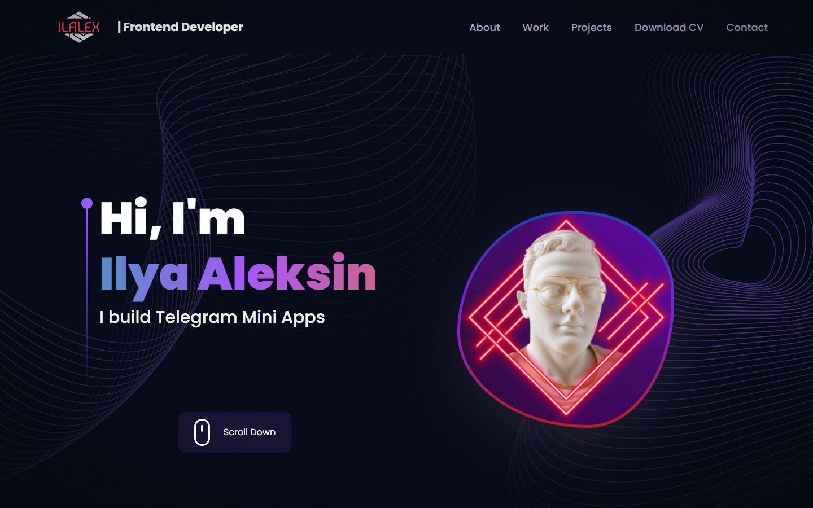

# web-3d-resume

Интерактивное портфолио-резюме фронтенд-разработчика с 3D-сценой на Three.js.
Одна страница: о себе, опыт, стек, проекты, скачивание CV и контакты.

**Деплой:** https://aleksin-official.vercel.app/

[](https://aleksin-official.vercel.app/)

## Стек

- **React 18** + **Vite 4**
- **Three.js** через `@react-three/fiber` и `@react-three/drei` — планета и звёздное небо
- **Framer Motion** — анимации появления секций
- **Tailwind CSS** — стили
- `react-vertical-timeline-component` — таймлайн опыта, `react-tilt` — наклон карточек

## Фишки

- 3D-планета с атмосферным ореолом и звёзды с параллаксом и мерцанием
- Рендер 3D ставится на паузу, когда канвас вне экрана
- Заголовки со scramble-эффектом, glitch-hover на проектах
- Подсветка границы карточек за курсором, кастомный курсор
- HUD-уголки секций, прогресс скролла, активный пункт навигации
- Зерно, виньетка, точечная сетка на фоне
- Уважает `prefers-reduced-motion`
- CV на русском и английском (PDF)

## Запуск

```bash
yarn
yarn dev
```

Dev-сервер стартует на порту `5173` и доступен в локальной сети (`--host`).

```bash
yarn build     # сборка в dist/
yarn preview   # просмотр собранной версии
```

## Структура

```
src/
  components/         секции страницы (Hero, About, Experience, Tech, Works, CV, Contact…)
  components/canvas/  3D-сцены: Earth, Stars
  constants/          весь контент: ссылки, опыт, стек, проекты
  hoc/SectionWrapper  обёртка секции с анимацией и якорем
  utils/motion.js     пресеты анимаций Framer Motion
  assets/             картинки, иконки, PDF резюме
public/planet/        glTF-модель планеты
cv-source/            HTML-исходники PDF-резюме (см. cv-source/README.md)
```

## Как поменять контент

Тексты, опыт, проекты и ссылки лежат в [`src/constants/index.js`](src/constants/index.js).
Картинки подключаются через [`src/assets/index.js`](src/assets/index.js).

PDF-резюме собираются из HTML в [`cv-source/`](cv-source/README.md) через headless Chrome.

## Благодарности

3D-модель «[Stylized planet](https://sketchfab.com/3d-models/stylized-planet-789725db86f547fc9163b00f302c3e70)»
от [cmzw](https://sketchfab.com/cmzw), лицензия [CC-BY-4.0](http://creativecommons.org/licenses/by/4.0/).
